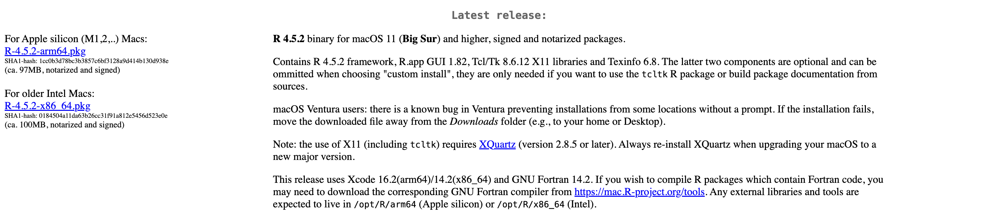
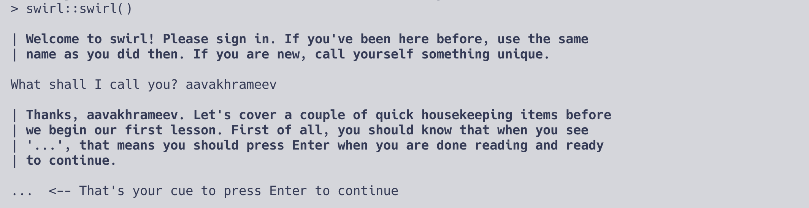

# pr 01 Vakhrameev
vakhrameevaleksandr@yandex.ru

## Цель работы

1.  Развить практические навыки использования языка программирования R
    для обработки данных
2.  Развить навыки работы в Rstudio IDE:

-   установка пакетов
-   работа с проектами в Rstudio
-   настройка и работа с Git

3.  Закрепить знания базовых типов данных языка R и простейших операций
    с ними

## Исходные данные

1.  Оепрационная система Darwin Mac.lan 25.0.0 Darwin Kernel Version
    25.0.0
2.  Positron
3.  R version 4.5.2

## Задание

Используя программный пакет swirl, освоить базовые операции в языке
программирования R.

## Ход работы

1.  Установить интерпретатор R

2.  Установить Rstudio IDE

3.  Установить программный пакет swirl: через интерфейс Rstudio IDE или
    функцией R install.packages(“swirl”)

4.  Запустить задание с помощью swirl::swirl()

5.  Выбрать из меню курсов 1. R Programming: The basics of programming
    in R

6.  Запустить подкурсы и выполнить: базовые структурные блоки (Basic
    Building Blocks) рабочие пространства и файлы (Workspace and Files)
    последовательности чисел (Sequences of Numbers) векторы (Vectors)
    пропущенные значения (Missing Values)

7.  Составить отчет и выложить его и исходный qmd/rmd файл в свой
    репозиторий

### Шаг №1

Устанавливаем интерпретатор R 

### Шаг №2

Устанавливаем IDE Positron 

### Шаг №3

Установим swirl

### Шаг №4

Запускаем задание

### Шаг №5

Выполняем задания из курса

#### Basic Building Blocks

    Selection: 1

      |                                                                      |   0%

    | In this lesson, we will explore some basic building blocks of the R
    | programming language.

    ...

      |==                                                                    |   3%
    | If at any point you'd like more information on a particular topic related to
    | R, you can type help.start() at the prompt, which will open a menu of
    | resources (either within RStudio or your default web browser, depending on
    | your setup). Alternatively, a simple web search often yields the answer
    | you're looking for.

    ...

      |====                                                                  |   5%
    | In its simplest form, R can be used as an interactive calculator. Type 5 + 7
    | and press Enter.

    > 12
    [1] 12

    | One more time. You can do it! Or, type info() for more options.

    | Type 5 + 7 and press Enter.

    > 
    > 5 + 7
    [1] 12

    | Perseverance, that's the answer.

      |======                                                                |   8%
    | R simply prints the result of 12 by default. However, R is a programming
    | language and often the reason we use a programming language as opposed to a
    | calculator is to automate some process or avoid unnecessary repetition.

    ...

      |=======                                                               |  11%
    | In this case, we may want to use our result from above in a second
    | calculation. Instead of retyping 5 + 7 every time we need it, we can just
    | create a new variable that stores the result.

    ...

      |=========                                                             |  13%
    | The way you assign a value to a variable in R is by using the assignment
    | operator, which is just a 'less than' symbol followed by a 'minus' sign. It
    | looks like this: <-

    ...

      |===========                                                           |  16%
    | Think of the assignment operator as an arrow. You are assigning the value on
    | the right side of the arrow to the variable name on the left side of the
    | arrow.

    ...

      |=============                                                         |  18%
    | To assign the result of 5 + 7 to a new variable called x, you type x <- 5 +
    | 7. This can be read as 'x gets 5 plus 7'. Give it a try now.

    > x <- 5+7

    | Nice work!

      |===============                                                       |  21%
    | You'll notice that R did not print the result of 12 this time. When you use
    | the assignment operator, R assumes that you don't want to see the result
    | immediately, but rather that you intend to use the result for something else
    | later on.

    ...

      |=================                                                     |  24%
    | To view the contents of the variable x, just type x and press Enter. Try it
    | now.

    > x
    [1] 12

    | You nailed it! Good job!

      |==================                                                    |  26%
    | Now, store the result of x - 3 in a new variable called y.

    > y <- x-3

    | Excellent job!

      |====================                                                  |  29%
    | What is the value of y? Type y to find out.

    > y
    [1] 9

    | You are really on a roll!

      |======================                                                |  32%
    | Now, let's create a small collection of numbers called a vector. Any object
    | that contains data is called a data structure and numeric vectors are the
    | simplest type of data structure in R. In fact, even a single number is
    | considered a vector of length one.

    ...

      |========================                                              |  34%
    | The easiest way to create a vector is with the c() function, which stands for
    | 'concatenate' or 'combine'. To create a vector containing the numbers 1.1, 9,
    | and 3.14, type c(1.1, 9, 3.14). Try it now and store the result in a variable
    | called z.

    > z <- c(1.1, 9, 3.14)

    | Perseverance, that's the answer.

      |==========================                                            |  37%
    | Anytime you have questions about a particular function, you can access R's
    | built-in help files via the `?` command. For example, if you want more
    | information on the c() function, type ?c without the parentheses that
    | normally follow a function name. Give it a try.

    > 
    > ?
    + q

    | Not quite! Try again. Or, type info() for more options.

    | Type ?c and press Enter. This will bring up the help file for the c()
    | function.

    > ?c

    | Excellent job!

      |============================                                          |  39%
    | Type z to view its contents. Notice that there are no commas separating the
    | values in the output.

    > z
    [1] 1.10 9.00 3.14

    | You are doing so well!

      |=============================                                         |  42%
    | You can combine vectors to make a new vector. Create a new vector that
    | contains z, 555, then z again in that order. Don't assign this vector to a
    | new variable, so that we can just see the result immediately.

    > c(z, 555, z)
    [1]   1.10   9.00   3.14 555.00   1.10   9.00   3.14

    | Keep working like that and you'll get there!

      |===============================                                       |  45%
    | Numeric vectors can be used in arithmetic expressions. Type the following to
    | see what happens: z * 2 + 100.

    > z*2+100
    [1] 102.20 118.00 106.28

    | All that hard work is paying off!

      |=================================                                     |  47%
    | First, R multiplied each of the three elements in z by 2. Then it added 100
    | to each element to get the result you see above.

    ...

      |===================================                                   |  50%
    | Other common arithmetic operators are `+`, `-`, `/`, and `^` (where x^2 means
    | 'x squared'). To take the square root, use the sqrt() function and to take
    | the absolute value, use the abs() function.

    ...

      |=====================================                                 |  53%
    | Take the square root of z - 1 and assign it to a new variable called my_sqrt.

    > sqrt(z-1)
    [1] 0.3162278 2.8284271 1.4628739

    | Not quite! Try again. Or, type info() for more options.

    | Assign the result of sqrt(z - 1) to a variable called my_sqrt.

    > my_sqrt <- sqrt(z-1)

    | You are doing so well!

      |=======================================                               |  55%
    | Before we view the contents of the my_sqrt variable, what do you think it
    | contains?

    1: a vector of length 0 (i.e. an empty vector)
    2: a single number (i.e a vector of length 1)
    3: a vector of length 3

    Selection: 1

    | Not quite, but you're learning! Try again.

    | Think about how R handled the other 'vectorized' operations:
    | element-by-element.

    1: a vector of length 0 (i.e. an empty vector)
    2: a single number (i.e a vector of length 1)
    3: a vector of length 3

    Selection: 3

    | Nice work!

      |=========================================                             |  58%
    | Print the contents of my_sqrt.

    > my_sqrt
    [1] 0.3162278 2.8284271 1.4628739

    | You are amazing!

      |==========================================                            |  61%
    | As you may have guessed, R first subtracted 1 from each element of z, then
    | took the square root of each element. This leaves you with a vector of the
    | same length as the original vector z.

    ...

      |============================================                          |  63%
    | Now, create a new variable called my_div that gets the value of z divided by
    | my_sqrt.

    > my_div <- z / my_sqrt

    | Your dedication is inspiring!

      |==============================================                        |  66%
    | Which statement do you think is true?

    1: my_div is undefined
    2: The first element of my_div is equal to the first element of z divided by the first element of my_sqrt, and so on...
    3: my_div is a single number (i.e a vector of length 1)

    Selection: 2

    | Perseverance, that's the answer.

      |================================================                      |  68%
    | Go ahead and print the contents of my_div.

    > my_div
    [1] 3.478505 3.181981 2.146460

    | Excellent job!

      |==================================================                    |  71%
    | When given two vectors of the same length, R simply performs the specified
    | arithmetic operation (`+`, `-`, `*`, etc.) element-by-element. If the vectors
    | are of different lengths, R 'recycles' the shorter vector until it is the
    | same length as the longer vector.

    ...

      |====================================================                  |  74%
    | When we did z * 2 + 100 in our earlier example, z was a vector of length 3,
    | but technically 2 and 100 are each vectors of length 1.

    ...

      |=====================================================                 |  76%
    | Behind the scenes, R is 'recycling' the 2 to make a vector of 2s and the 100
    | to make a vector of 100s. In other words, when you ask R to compute z * 2 +
    | 100, what it really computes is this: z * c(2, 2, 2) + c(100, 100, 100).

    ...

      |=======================================================               |  79%
    | To see another example of how this vector 'recycling' works, try adding c(1,
    | 2, 3, 4) and c(0, 10). Don't worry about saving the result in a new variable.

    > c(1, 2, 3, 4) + c(0, 10)
    [1]  1 12  3 14

    | Keep up the great work!

      |=========================================================             |  82%
    | If the length of the shorter vector does not divide evenly into the length of
    | the longer vector, R will still apply the 'recycling' method, but will throw
    | a warning to let you know something fishy might be going on.

    ...

      |===========================================================           |  84%
    | Try c(1, 2, 3, 4) + c(0, 10, 100) for an example.

    > c(1, 2, 3, 4) + c(0, 10, 100)
    [1]   1  12 103   4
    Warning message:
    In c(1, 2, 3, 4) + c(0, 10, 100) :
      longer object length is not a multiple of shorter object length

    | You are quite good my friend!

      |=============================================================         |  87%
    | Before concluding this lesson, I'd like to show you a couple of time-saving
    | tricks.

    ...

      |===============================================================       |  89%
    | Earlier in the lesson, you computed z * 2 + 100. Let's pretend that you made
    | a mistake and that you meant to add 1000 instead of 100. You could either
    | re-type the expression, or...

    ...

      |================================================================      |  92%
    | In many programming environments, the up arrow will cycle through previous
    | commands. Try hitting the up arrow on your keyboard until you get to this
    | command (z * 2 + 100), then change 100 to 1000 and hit Enter. If the up arrow
    | doesn't work for you, just type the corrected command.

    > 
    > z*2+100
    [1] 102.20 118.00 106.28

    | Not quite right, but keep trying. Or, type info() for more options.

    | If your environment does not support the up arrow feature, then just type the
    | corrected command to move on.

    > z*2+1000
    [1] 1002.20 1018.00 1006.28

    | You are really on a roll!

      |==================================================================    |  95%
    | Finally, let's pretend you'd like to view the contents of a variable that you
    | created earlier, but you can't seem to remember if you named it my_div or
    | myDiv. You could try both and see what works, or...

    ...

      |====================================================================  |  97%
    | You can type the first two letters of the variable name, then hit the Tab key
    | (possibly more than once). Most programming environments will provide a list
    | of variables that you've created that begin with 'my'. This is called
    | auto-completion and can be quite handy when you have many variables in your
    | workspace. Give it a try. (If auto-completion doesn't work for you, just type
    | my_div and press Enter.)

    > my_div
    [1] 3.478505 3.181981 2.146460

    | All that practice is paying off!

      |======================================================================| 100%
    | Would you like to receive credit for completing this course on Coursera.org?

    1: Yes
    2: No

    Selection: 2

#### Workspace and Files

    Selection: 2

      |                                                                      |   0%

    | In this lesson, you'll learn how to examine your local workspace in R and
    | begin to explore the relationship between your workspace and the file system
    | of your machine.

    ...

      |==                                                                    |   3%
    | Because different operating systems have different conventions with regards
    | to things like file paths, the outputs of these commands may vary across
    | machines.

    ...

      |====                                                                  |   5%
    | However it's important to note that R provides a common API (a common set of
    | commands) for interacting with files, that way your code will work across
    | different kinds of computers.

    ...

      |=====                                                                 |   8%
    | Let's jump right in so you can get a feel for how these special functions
    | work!

    ...

      |=======                                                               |  10%
    | Determine which directory your R session is using as its current working
    | directory using getwd().

    > getwd()
    [1] "/Users/lir1ka/Documents/vuz/threat_hunting"

    | Excellent job!

      |=========                                                             |  13%
    | List all the objects in your local workspace using ls().

    > ls()
    [1] "my_div"  "my_sqrt" "x"       "y"       "z"      

    | That's correct!

      |===========                                                           |  15%
    | Some R commands are the same as their equivalents commands on Linux or on a
    | Mac. Both Linux and Mac operating systems are based on an operating system
    | called Unix. It's always a good idea to learn more about Unix!

    ...

      |=============                                                         |  18%
    | Assign 9 to x using x <- 9.

    > x <- 90

    | Not quite right, but keep trying. Or, type info() for more options.

    | Type x <- 9 to assign 9 to x.

    > x <- 9

    | You got it right!

      |==============                                                        |  21%
    | Now take a look at objects that are in your workspace using ls().

    > ls()
    [1] "my_div"  "my_sqrt" "x"       "y"       "z"      

    | That's correct!

      |================                                                      |  23%
    | List all the files in your working directory using list.files() or dir().

    > list.files()
    [1] "pr_01"

    | Nice work!

      |==================                                                    |  26%
    | As we go through this lesson, you should be examining the help page for each
    | new function. Check out the help page for list.files with the command
    | ?list.files.

    > ?list.files

    | Nice work!

      |====================                                                  |  28%
    | One of the most helpful parts of any R help file is the See Also section.
    | Read that section for list.files. Some of these functions may be used in
    | later portions of this lesson.

    ...

      |======================                                                |  31%
    | Using the args() function on a function name is also a handy way to see what
    | arguments a function can take.

    ...args()

      |=======================                                               |  33%
    | Use the args() function to determine the arguments to list.files().

    > list.files()
    [1] "pr_01"

    | Not quite right, but keep trying. Or, type info() for more options.

    | Type args(list.files) to see the arguments to list.files.

    > args(list.files)
    function (path = ".", pattern = NULL, all.files = FALSE, full.names = FALSE, 
        recursive = FALSE, ignore.case = FALSE, include.dirs = FALSE, 
        no.. = FALSE) 
    NULL

    | You got it right!

      |=========================                                             |  36%
    | Assign the value of the current working directory to a variable called
    | "old.dir".

    > old.dir <- getwd()

    | That's a job well done!

      |===========================                                           |  38%
    | We will use old.dir at the end of this lesson to move back to the place that
    | we started. A lot of query functions like getwd() have the useful property
    | that they return the answer to the question as a result of the function.

    ...

      |=============================                                         |  41%
    | Use dir.create() to create a directory in the current working directory
    | called "testdir".

    > dir.create() testdir
    Error: unexpected symbol in "dir.create() testdir"
    > dir.create() testdir
    Error: unexpected symbol in "dir.create() testdir"
    > dir.create("testdir") 

    | You are amazing!

      |===============================                                       |  44%
    | We will do all our work in this new directory and then delete it after we are
    | done. This is the R analog to "Take only pictures, leave only footprints."

    ...

      |================================                                      |  46%
    | Set your working directory to "testdir" with the setwd() command.

    > setwd("testdir")

    | You are doing so well!

      |==================================                                    |  49%
    | In general, you will want your working directory to be someplace sensible,
    | perhaps created for the specific project that you are working on. In fact,
    | organizing your work in R packages using RStudio is an excellent option.
    | Check out RStudio at http://www.rstudio.com/

    ...

      |====================================                                  |  51%
    | Create a file in your working directory called "mytest.R" using the
    | file.create() function.

    > file.create("mystest.R")
    [1] TRUE

    | You almost had it, but not quite. Try again. Or, type info() for more
    | options.

    | file.create("mytest.R") will get the job done!

    > ls()
    [1] "my_div"  "my_sqrt" "old.dir" "x"       "y"       "z"      

    | Nice try, but that's not exactly what I was hoping for. Try again. Or, type
    | info() for more options.

    | file.create("mytest.R") will get the job done!

    > lost.files()
    Error in lost.files() : could not find function "lost.files"
    > list.files()
    [1] "mystest.R"

    | Not quite, but you're learning! Try again. Or, type info() for more options.

    | file.create("mytest.R") will get the job done!

    > file.create("mytest.R")
    [1] TRUE

    | All that practice is paying off!

      |======================================                                |  54%
    | This should be the only file in this newly created directory. Let's check
    | this by listing all the files in the current directory.

    > list.files()
    [1] "mystest.R" "mytest.R" 

    | You nailed it! Good job!

      |=======================================                               |  56%
    | Check to see if "mytest.R" exists in the working directory using the
    | file.exists() function.

    > file.exists("mytest.R")
    [1] TRUE

    | Perseverance, that's the answer.

      |=========================================                             |  59%
    | These sorts of functions are excessive for interactive use. But, if you are
    | running a program that loops through a series of files and does some
    | processing on each one, you will want to check to see that each exists before
    | you try to process it.

    ...

      |===========================================                           |  62%
    | Access information about the file "mytest.R" by using file.info().

    > file.info("mytest.R")
             size isdir mode               mtime               ctime
    mytest.R    0 FALSE  644 2025-11-07 16:16:57 2025-11-07 16:16:57
                           atime uid gid  uname grname
    mytest.R 2025-11-07 16:16:57 501  20 lir1ka  staff

    | You are quite good my friend!

      |=============================================                         |  64%
    | You can use the $ operator --- e.g., file.info("mytest.R")$mode --- to grab
    | specific items.

    ...

      |===============================================                       |  67%
    | Change the name of the file "mytest.R" to "mytest2.R" by using file.rename().

    > file.rename("mytest.R", "mytest2.R")
    [1] TRUE

    | You got it right!

      |================================================                      |  69%
    | Your operating system will provide simpler tools for these sorts of tasks,
    | but having the ability to manipulate files programatically is useful. You
    | might now try to delete mytest.R using file.remove('mytest.R'), but that
    | won't work since mytest.R no longer exists. You have already renamed it.

    ...

      |==================================================                    |  72%
    | Make a copy of "mytest2.R" called "mytest3.R" using file.copy().

    > file.copy("mytest2.R", "mytest3.R")
    [1] TRUE

    | Keep working like that and you'll get there!

      |====================================================                  |  74%
    | You now have two files in the current directory. That may not seem very
    | interesting. But what if you were working with dozens, or millions, of
    | individual files? In that case, being able to programatically act on many
    | files would be absolutely necessary. Don't forget that you can, temporarily,
    | leave the lesson by typing play() and then return by typing nxt().

    ...

      |======================================================                |  77%
    | Provide the relative path to the file "mytest3.R" by using file.path().

    > file.path("mytest3.R")
    [1] "mytest3.R"

    | Perseverance, that's the answer.

      |========================================================              |  79%
    | You can use file.path to construct file and directory paths that are
    | independent of the operating system your R code is running on. Pass 'folder1'
    | and 'folder2' as arguments to file.path to make a platform-independent
    | pathname.

    > file.path("folder1", "folder2")
    [1] "folder1/folder2"

    | Keep working like that and you'll get there!

      |=========================================================             |  82%
    | Take a look at the documentation for dir.create by entering ?dir.create .
    | Notice the 'recursive' argument. In order to create nested directories,
    | 'recursive' must be set to TRUE.

    > ?dir.create
    ^[OB^[OB^[OB^[OB
    | Your dedication is inspiring!

      |===========================================================           |  85%
    | Create a directory in the current working directory called "testdir2" and a
    | subdirectory for it called "testdir3", all in one command by using
    | dir.create() and file.path().

    > dir.create(file.path("testdir2", "testdir3"), recursive = TRUE)

    | Nice work!

      |=============================================================         |  87%
    | Go back to your original working directory using setwd(). (Recall that we
    | created the variable old.dir with the full path for the orginal working
    | directory at the start of these questions.)

    > setwd(old.dir)

    | You nailed it! Good job!

      |===============================================================       |  90%
    | It is often helpful to save the settings that you had before you began an
    | analysis and then go back to them at the end. This trick is often used within
    | functions; you save, say, the par() settings that you started with, mess
    | around a bunch, and then set them back to the original values at the end.
    | This isn't the same as what we have done here, but it seems similar enough to
    | mention.

    ...

      |=================================================================     |  92%
    | After you finish this lesson delete the 'testdir' directory that you just
    | left (and everything in it)

    ...

      |==================================================================    |  95%
    | Take nothing but results. Leave nothing but assumptions. That sounds like
    | 'Take nothing but pictures. Leave nothing but footprints.' But it makes no
    | sense! Surely our readers can come up with a better motto . . .

    ...

      |====================================================================  |  97%
    | In this lesson, you learned how to examine your R workspace and work with the
    | file system of your machine from within R. Thanks for playing!

    ...

      |======================================================================| 100%
    | Would you like to receive credit for completing this course on Coursera.org?

    1: No
    2: Yes

    Selection: 

#### Sequences of Numbers

    Selection: 3

      |                                                                      |   0%

    | In this lesson, you'll learn how to create sequences of numbers in R.

    ...

      |===                                                                   |   4%
    | The simplest way to create a sequence of numbers in R is by using the `:`
    | operator. Type 1:20 to see how it works.

    > 
    > 1:20
     [1]  1  2  3  4  5  6  7  8  9 10 11 12 13 14 15 16 17 18 19 20

    | All that practice is paying off!

      |======                                                                |   9%
    | That gave us every integer between (and including) 1 and 20. We could also
    | use it to create a sequence of real numbers. For example, try pi:10.

    > pi:10
    [1] 3.141593 4.141593 5.141593 6.141593 7.141593 8.141593 9.141593

    | All that hard work is paying off!

      |=========                                                             |  13%
    | The result is a vector of real numbers starting with pi (3.142...) and
    | increasing in increments of 1. The upper limit of 10 is never reached, since
    | the next number in our sequence would be greater than 10.

    ...

      |============                                                          |  17%
    | What happens if we do 15:1? Give it a try to find out.

    > 15:1
     [1] 15 14 13 12 11 10  9  8  7  6  5  4  3  2  1

    | All that practice is paying off!

      |===============                                                       |  22%
    | It counted backwards in increments of 1! It's unlikely we'd want this
    | behavior, but nonetheless it's good to know how it could happen.

    ...

      |==================                                                    |  26%
    | Remember that if you have questions about a particular R function, you can
    | access its documentation with a question mark followed by the function name:
    | ?function_name_here. However, in the case of an operator like the colon used
    | above, you must enclose the symbol in backticks like this: ?`:`. (NOTE: The
    | backtick (`) key is generally located in the top left corner of a keyboard,
    | above the Tab key. If you don't have a backtick key, you can use regular
    | quotes.)

    ...

      |=====================                                                 |  30%
    | Pull up the documentation for `:` now.

    > :
    Error: unexpected ':' in ":"
    > ?:
    Error: unexpected ':' in "?:"
    > 
    > ?":"

    | Excellent work!

      |========================                                              |  35%
    | Often, we'll desire more control over a sequence we're creating than what the
    | `:` operator gives us. The seq() function serves this purpose.

    ...

      |===========================                                           |  39%
    | The most basic use of seq() does exactly the same thing as the `:` operator.
    | Try seq(1, 20) to see this.

    > seq(1, 20)
     [1]  1  2  3  4  5  6  7  8  9 10 11 12 13 14 15 16 17 18 19 20

    | Excellent job!

      |==============================                                        |  43%
    | This gives us the same output as 1:20. However, let's say that instead we
    | want a vector of numbers ranging from 0 to 10, incremented by 0.5. seq(0, 10,
    | by=0.5) does just that. Try it out.

    > seq(0, 10, by=0.5)
     [1]  0.0  0.5  1.0  1.5  2.0  2.5  3.0  3.5  4.0  4.5  5.0  5.5  6.0  6.5  7.0
    [16]  7.5  8.0  8.5  9.0  9.5 10.0

    | You are really on a roll!

      |=================================                                     |  48%
    | Or maybe we don't care what the increment is and we just want a sequence of
    | 30 numbers between 5 and 10. seq(5, 10, length=30) does the trick. Give it a
    | shot now and store the result in a new variable called my_seq.

    > seq(5,10, length=30)
     [1]  5.000000  5.172414  5.344828  5.517241  5.689655  5.862069  6.034483
     [8]  6.206897  6.379310  6.551724  6.724138  6.896552  7.068966  7.241379
    [15]  7.413793  7.586207  7.758621  7.931034  8.103448  8.275862  8.448276
    [22]  8.620690  8.793103  8.965517  9.137931  9.310345  9.482759  9.655172
    [29]  9.827586 10.000000

    | Not quite right, but keep trying. Or, type info() for more options.

    | You're using the same function here, but changing its arguments for different
    | results. Be sure to store the result in a new variable called my_seq, like
    | this: my_seq <- seq(5, 10, length=30).

    > my_seq <- seq(5, 10, length=30)

    | Your dedication is inspiring!

      |=====================================                                 |  52%
    | To confirm that my_seq has length 30, we can use the length() function. Try
    | it now.

    > 
    > length(my_seq)
    [1] 30

    | You are doing so well!

      |========================================                              |  57%
    | Let's pretend we don't know the length of my_seq, but we want to generate a
    | sequence of integers from 1 to N, where N represents the length of the my_seq
    | vector. In other words, we want a new vector (1, 2, 3, ...) that is the same
    | length as my_seq.

    ...

      |===========================================                           |  61%
    | There are several ways we could do this. One possibility is to combine the
    | `:` operator and the length() function like this: 1:length(my_seq). Give that
    | a try.

    > 
    > 1:length(my_seq)
     [1]  1  2  3  4  5  6  7  8  9 10 11 12 13 14 15 16 17 18 19 20 21 22 23 24 25
    [26] 26 27 28 29 30

    | You are really on a roll!

      |==============================================                        |  65%
    | Another option is to use seq(along.with = my_seq). Give that a try.

    > seq(along.with = my_seq
    + seq(along.with = my_seq)
    Error: unexpected symbol in:
    "seq(along.with = my_seq
    seq"
    > seq(along.with = my_seq)
    >  seq(along.with = my_seq)
     [1]  1  2  3  4  5  6  7  8  9 10 11 12 13 14 15 16 17 18 19 20 21 22 23 24 25
    [26] 26 27 28 29 30

    | Excellent work!

      |=================================================                     |  70%
    | However, as is the case with many common tasks, R has a separate built-in
    | function for this purpose called seq_along(). Type seq_along(my_seq) to see
    | it in action.

    > seq_along(my_seq)
     [1]  1  2  3  4  5  6  7  8  9 10 11 12 13 14 15 16 17 18 19 20 21 22 23 24 25
    [26] 26 27 28 29 30

    | That's correct!

      |====================================================                  |  74%
    | There are often several approaches to solving the same problem, particularly
    | in R. Simple approaches that involve less typing are generally best. It's
    | also important for your code to be readable, so that you and others can
    | figure out what's going on without too much hassle.

    ...

      |=======================================================               |  78%
    | If R has a built-in function for a particular task, it's likely that function
    | is highly optimized for that purpose and is your best option. As you become a
    | more advanced R programmer, you'll design your own functions to perform tasks
    | when there are no better options. We'll explore writing your own functions in
    | future lessons.

    ...

      |==========================================================            |  83%
    | One more function related to creating sequences of numbers is rep(), which
    | stands for 'replicate'. Let's look at a few uses.

    ...

      |=============================================================         |  87%
    | If we're interested in creating a vector that contains 40 zeros, we can use
    | rep(0, times = 40). Try it out.

    > rep(0, times = 40)
     [1] 0 0 0 0 0 0 0 0 0 0 0 0 0 0 0 0 0 0 0 0 0 0 0 0 0 0 0 0 0 0 0 0 0 0 0 0 0 0
    [39] 0 0

    | You are really on a roll!

      |================================================================      |  91%
    | If instead we want our vector to contain 10 repetitions of the vector (0, 1,
    | 2), we can do rep(c(0, 1, 2), times = 10). Go ahead.

    > 
    > rep(c(0, 1, 2), times = 10)
     [1] 0 1 2 0 1 2 0 1 2 0 1 2 0 1 2 0 1 2 0 1 2 0 1 2 0 1 2 0 1 2

    | Keep working like that and you'll get there!

      |===================================================================   |  96%
    | Finally, let's say that rather than repeating the vector (0, 1, 2) over and
    | over again, we want our vector to contain 10 zeros, then 10 ones, then 10
    | twos. We can do this with the `each` argument. Try rep(c(0, 1, 2), each =
    | 10).

    > 
    > rep(c(0, 1, 2), each = 10)
     [1] 0 0 0 0 0 0 0 0 0 0 1 1 1 1 1 1 1 1 1 1 2 2 2 2 2 2 2 2 2 2

    | You nailed it! Good job!

#### Vectors

    Selection: 4

      |                                                                      |   0%

    | The simplest and most common data structure in R is the vector.

    ...

      |==                                                                    |   3%
    | Vectors come in two different flavors: atomic vectors and lists. An atomic
    | vector contains exactly one data type, whereas a list may contain multiple
    | data types. We'll explore atomic vectors further before we get to lists.

    ...

      |====                                                                  |   5%
    | In previous lessons, we dealt entirely with numeric vectors, which are one
    | type of atomic vector. Other types of atomic vectors include logical,
    | character, integer, and complex. In this lesson, we'll take a closer look at
    | logical and character vectors.

    ...

      |======                                                                |   8%
    | Logical vectors can contain the values TRUE, FALSE, and NA (for 'not
    | available'). These values are generated as the result of logical
    | 'conditions'. Let's experiment with some simple conditions.

    ...

      |=======                                                               |  11%
    | First, create a numeric vector num_vect that contains the values 0.5, 55,
    | -10, and 6.

    > c(0.5, 55, -10, 6)
    [1]   0.5  55.0 -10.0   6.0

    | Not exactly. Give it another go. Or, type info() for more options.

    | Recall that the c() function is used for creating a vector. If you forget how
    | to use it, use ?c to access the help file. Don't forget to assign the result
    | to a new variable called num_vect.

    > num_vect <- c(0.5, 55, -10, 6)

    | Keep up the great work!

      |=========                                                             |  13%
    | Now, create a variable called tf that gets the result of num_vect < 1, which
    | is read as 'num_vect is less than 1'.

    > tf <- num_vect < 1

    | That's the answer I was looking for.

      |===========                                                           |  16%
    | What do you think tf will look like?

    1: a single logical value
    2: a vector of 4 logical values

    Selection: 2

    | That's the answer I was looking for.

      |=============                                                         |  18%
    | Print the contents of tf now.

    > tf
    [1]  TRUE FALSE  TRUE FALSE

    | Keep working like that and you'll get there!

      |===============                                                       |  21%
    | The statement num_vect < 1 is a condition and tf tells us whether each
    | corresponding element of our numeric vector num_vect satisfies this
    | condition.

    ...

      |=================                                                     |  24%
    | The first element of num_vect is 0.5, which is less than 1 and therefore the
    | statement 0.5 < 1 is TRUE. The second element of num_vect is 55, which is
    | greater than 1, so the statement 55 < 1 is FALSE. The same logic applies for
    | the third and fourth elements.

    ...

      |==================                                                    |  26%
    | Let's try another. Type num_vect >= 6 without assigning the result to a new
    | variable.

    > 
    > num_vect >= 6
    [1] FALSE  TRUE FALSE  TRUE

    | You're the best!

      |====================                                                  |  29%
    | This time, we are asking whether each individual element of num_vect is
    | greater than OR equal to 6. Since only 55 and 6 are greater than or equal to
    | 6, the second and fourth elements of the result are TRUE and the first and
    | third elements are FALSE.

    ...

      |======================                                                |  32%
    | The `<` and `>=` symbols in these examples are called 'logical operators'.
    | Other logical operators include `>`, `<=`, `==` for exact equality, and `!=`
    | for inequality.

    ...

      |========================                                              |  34%
    | If we have two logical expressions, A and B, we can ask whether at least one
    | is TRUE with A | B (logical 'or' a.k.a. 'union') or whether they are both
    | TRUE with A & B (logical 'and' a.k.a. 'intersection'). Lastly, !A is the
    | negation of A and is TRUE when A is FALSE and vice versa.

    ...

      |==========================                                            |  37%
    | It's a good idea to spend some time playing around with various combinations
    | of these logical operators until you get comfortable with their use. We'll do
    | a few examples here to get you started.

    ...

      |============================                                          |  39%
    | Try your best to predict the result of each of the following statements. You
    | can use pencil and paper to work them out if it's helpful. If you get stuck,
    | just guess and you've got a 50% chance of getting the right answer!

    ...

      |=============================                                         |  42%
    | (3 > 5) & (4 == 4)

    1: TRUE
    2: FALSE

    Selection: 2

    | You are amazing!

      |===============================                                       |  45%
    | (TRUE == TRUE) | (TRUE == FALSE)

    1: FALSE
    2: TRUE

    Selection: 2

    | You're the best!

      |=================================                                     |  47%
    | ((111 >= 111) | !(TRUE)) & ((4 + 1) == 5)

    1: FALSE
    2: TRUE

    Selection: 2

    | That's the answer I was looking for.

      |===================================                                   |  50%
    | Don't worry if you found these to be tricky. They're supposed to be. Working
    | with logical statements in R takes practice, but your efforts will be
    | rewarded in future lessons (e.g. subsetting and control structures).

    ...

      |=====================================                                 |  53%
    | Character vectors are also very common in R. Double quotes are used to
    | distinguish character objects, as in the following example.

    ...

      |=======================================                               |  55%
    | Create a character vector that contains the following words: "My", "name",
    | "is". Remember to enclose each word in its own set of double quotes, so that
    | R knows they are character strings. Store the vector in a variable called
    | my_char.

    > 
    > my_char <- c("My", "name", "is")

    | You nailed it! Good job!

      |=========================================                             |  58%
    | Print the contents of my_char to see what it looks like.

    > my_char
    [1] "My"   "name" "is"  

    | You are amazing!

      |==========================================                            |  61%
    | Right now, my_char is a character vector of length 3. Let's say we want to
    | join the elements of my_char together into one continuous character string
    | (i.e. a character vector of length 1). We can do this using the paste()
    | function.

    ...

      |============================================                          |  63%
    | Type paste(my_char, collapse = " ") now. Make sure there's a space between
    | the double quotes in the `collapse` argument. You'll see why in a second.

    > 
    > paste(my_char, collapse = " ")
    [1] "My name is"

    | You are really on a roll!

      |==============================================                        |  66%
    | The `collapse` argument to the paste() function tells R that when we join
    | together the elements of the my_char character vector, we'd like to separate
    | them with single spaces.

    ...

      |================================================                      |  68%
    | It seems that we're missing something.... Ah, yes! Your name!

    ...

      |==================================================                    |  71%
    | To add (or 'concatenate') your name to the end of my_char, use the c()
    | function like this: c(my_char, "your_name_here"). Place your name in double
    | quotes where I've put "your_name_here". Try it now, storing the result in a
    | new variable called my_name.

    > 

    > my_name <- c(my_char, "aavakhrameev")

    | Excellent work!

      |====================================================                  |  74%
    | Take a look at the contents of my_name.

    > my_name
    [1] "My"           "name"         "is"           "aavakhrameev"

    | All that practice is paying off!

      |=====================================================                 |  76%
    | Now, use the paste() function once more to join the words in my_name together
    | into a single character string. Don't forget to say collapse = " "!

    > paste(my_name, collapse = " ")
    [1] "My name is aavakhrameev"

    | That's the answer I was looking for.

      |=======================================================               |  79%
    | In this example, we used the paste() function to collapse the elements of a
    | single character vector. paste() can also be used to join the elements of
    | multiple character vectors.

    ...

      |=========================================================             |  82%
    | In the simplest case, we can join two character vectors that are each of
    | length 1 (i.e. join two words). Try paste("Hello", "world!", sep = " "),
    | where the `sep` argument tells R that we want to separate the joined elements
    | with a single space.

    > 
    > paste("Hello", "world!", sep = " ")
    [1] "Hello world!"

    | You are really on a roll!

      |===========================================================           |  84%
    | For a slightly more complicated example, we can join two vectors, each of
    | length 3. Use paste() to join the integer vector 1:3 with the character
    | vector c("X", "Y", "Z"). This time, use sep = "" to leave no space between
    | the joined elements.

    > 
    > paste(1:3, c("X", "Y", "Z"), sep = "")
    [1] "1X" "2Y" "3Z"

    | You got it!

      |=============================================================         |  87%
    | What do you think will happen if our vectors are of different length? (Hint:
    | we talked about this in a previous lesson.)

    ...

      |===============================================================       |  89%
    | Vector recycling! Try paste(LETTERS, 1:4, sep = "-"), where LETTERS is a
    | predefined variable in R containing a character vector of all 26 letters in
    | the English alphabet.

    > paste(LETTERS, 1:4, sep = "-")
     [1] "A-1" "B-2" "C-3" "D-4" "E-1" "F-2" "G-3" "H-4" "I-1" "J-2" "K-3" "L-4"
    [13] "M-1" "N-2" "O-3" "P-4" "Q-1" "R-2" "S-3" "T-4" "U-1" "V-2" "W-3" "X-4"
    [25] "Y-1" "Z-2"

    | All that practice is paying off!

      |================================================================      |  92%
    | Since the character vector LETTERS is longer than the numeric vector 1:4, R
    | simply recycles, or repeats, 1:4 until it matches the length of LETTERS.

    ...

      |==================================================================    |  95%
    | Also worth noting is that the numeric vector 1:4 gets 'coerced' into a
    | character vector by the paste() function.

    ...

      |====================================================================  |  97%
    | We'll discuss coercion in another lesson, but all it really means is that the
    | numbers 1, 2, 3, and 4 in the output above are no longer numbers to R, but
    | rather characters "1", "2", "3", and "4".

    ...

      |======================================================================| 100%
    | Would you like to receive credit for completing this course on Coursera.org?

    1: No
    2: Yes

#### Missing Values

    Selection: 5

      |                                                                      |   0%

    | Missing values play an important role in statistics and data analysis. Often,
    | missing values must not be ignored, but rather they should be carefully
    | studied to see if there's an underlying pattern or cause for their
    | missingness.

    ...

      |====                                                                  |   5%
    | In R, NA is used to represent any value that is 'not available' or 'missing'
    | (in the statistical sense). In this lesson, we'll explore missing values
    | further.

    ...

      |=======                                                               |  10%
    | Any operation involving NA generally yields NA as the result. To illustrate,
    | let's create a vector c(44, NA, 5, NA) and assign it to a variable x.

    > 
    > x <- c(44, NA, 5, NA)

    | That's correct!

      |===========                                                           |  15%
    | Now, let's multiply x by 3.

    > x*3
    [1] 132  NA  15  NA

    | You got it right!

      |==============                                                        |  20%
    | Notice that the elements of the resulting vector that correspond with the NA
    | values in x are also NA.

    ...

      |==================                                                    |  25%
    | To make things a little more interesting, lets create a vector containing
    | 1000 draws from a standard normal distribution with y <- rnorm(1000).

    > 
    > y <- rnorm(1000)

    | You are amazing!

      |=====================                                                 |  30%
    | Next, let's create a vector containing 1000 NAs with z <- rep(NA, 1000).

    > z <- rep(NA, 1000)

    | You got it!

      |=========================                                             |  35%
    | Finally, let's select 100 elements at random from these 2000 values
    | (combining y and z) such that we don't know how many NAs we'll wind up with
    | or what positions they'll occupy in our final vector -- my_data <-
    | sample(c(y, z), 100).

    > my_data <- sample(c(y, z), 100)

    | You're the best!

      |============================                                          |  40%
    | Let's first ask the question of where our NAs are located in our data. The
    | is.na() function tells us whether each element of a vector is NA. Call
    | is.na() on my_data and assign the result to my_na.

    > my_na <- is.na(my_data)

    | You nailed it! Good job!

      |================================                                      |  45%
    | Now, print my_na to see what you came up with.

    > my_na
      [1]  TRUE FALSE  TRUE  TRUE  TRUE  TRUE FALSE  TRUE  TRUE FALSE  TRUE  TRUE
     [13]  TRUE FALSE FALSE  TRUE  TRUE  TRUE  TRUE  TRUE  TRUE  TRUE FALSE FALSE
     [25] FALSE  TRUE FALSE FALSE  TRUE  TRUE FALSE FALSE FALSE FALSE  TRUE  TRUE
     [37] FALSE  TRUE  TRUE FALSE  TRUE  TRUE FALSE  TRUE  TRUE  TRUE FALSE FALSE
     [49] FALSE  TRUE  TRUE FALSE FALSE  TRUE  TRUE FALSE  TRUE FALSE  TRUE  TRUE
     [61] FALSE  TRUE  TRUE  TRUE FALSE FALSE FALSE  TRUE  TRUE  TRUE FALSE FALSE
     [73]  TRUE FALSE  TRUE FALSE  TRUE FALSE  TRUE  TRUE  TRUE FALSE  TRUE  TRUE
     [85]  TRUE  TRUE FALSE  TRUE  TRUE  TRUE  TRUE  TRUE FALSE  TRUE FALSE FALSE
     [97] FALSE FALSE FALSE  TRUE

    | You are really on a roll!

      |===================================                                   |  50%
    | Everywhere you see a TRUE, you know the corresponding element of my_data is
    | NA. Likewise, everywhere you see a FALSE, you know the corresponding element
    | of my_data is one of our random draws from the standard normal distribution.

    ...

      |======================================                                |  55%
    | In our previous discussion of logical operators, we introduced the `==`
    | operator as a method of testing for equality between two objects. So, you
    | might think the expression my_data == NA yields the same results as is.na().
    | Give it a try.

    > my_data == NA
      [1] NA NA NA NA NA NA NA NA NA NA NA NA NA NA NA NA NA NA NA NA NA NA NA NA NA
     [26] NA NA NA NA NA NA NA NA NA NA NA NA NA NA NA NA NA NA NA NA NA NA NA NA NA
     [51] NA NA NA NA NA NA NA NA NA NA NA NA NA NA NA NA NA NA NA NA NA NA NA NA NA
     [76] NA NA NA NA NA NA NA NA NA NA NA NA NA NA NA NA NA NA NA NA NA NA NA NA NA

    | Keep up the great work!

      |==========================================                            |  60%
    | The reason you got a vector of all NAs is that NA is not really a value, but
    | just a placeholder for a quantity that is not available. Therefore the
    | logical expression is incomplete and R has no choice but to return a vector
    | of the same length as my_data that contains all NAs.

    ...

      |==============================================                        |  65%
    | Don't worry if that's a little confusing. The key takeaway is to be cautious
    | when using logical expressions anytime NAs might creep in, since a single NA
    | value can derail the entire thing.

    ...

      |=================================================                     |  70%
    | So, back to the task at hand. Now that we have a vector, my_na, that has a
    | TRUE for every NA and FALSE for every numeric value, we can compute the total
    | number of NAs in our data.

    ...

      |====================================================                  |  75%
    | The trick is to recognize that underneath the surface, R represents TRUE as
    | the number 1 and FALSE as the number 0. Therefore, if we take the sum of a
    | bunch of TRUEs and FALSEs, we get the total number of TRUEs.

    ...

      |========================================================              |  80%
    | Let's give that a try here. Call the sum() function on my_na to count the
    | total number of TRUEs in my_na, and thus the total number of NAs in my_data.
    | Don't assign the result to a new variable.

    > my_data
      [1]          NA -0.99642279          NA          NA          NA          NA
      [7]  1.05277830          NA          NA  1.46436183          NA          NA
     [13]          NA -0.44597491 -0.81729493          NA          NA          NA
     [19]          NA          NA          NA          NA  0.21633804 -1.12428137
     [25] -1.78576916          NA -0.79359622 -1.28748809          NA          NA
     [31] -0.50186848  0.37526709  0.14356408 -0.31895537          NA          NA
     [37]  0.42623201          NA          NA  1.69784814          NA          NA
     [43] -1.62528597          NA          NA          NA -1.11237237 -0.16193126
     [49] -1.97783548          NA          NA -2.07827442  0.25037472          NA
     [55]          NA  0.78443327          NA  0.30520120          NA          NA
     [61] -0.66554019          NA          NA          NA  0.21469744  0.96740531
     [67]  0.27222210          NA          NA          NA -0.64545095 -0.35824806
     [73]          NA -0.08693269          NA  1.43999725          NA -0.63687157
     [79]          NA          NA          NA -1.04017208          NA          NA
     [85]          NA          NA  1.38445986          NA          NA          NA
     [91]          NA          NA -2.39043921          NA -0.77680194 -0.89642334
     [97]  1.00326355  0.42074439  1.70787753          NA

    | Nice try, but that's not exactly what I was hoping for. Try again. Or, type
    | info() for more options.

    | Use sum(my_na) to count the number NAs in the data.

    > sum(my_na)
    [1] 59

    | That's correct!

      |============================================================          |  85%
    | Pretty cool, huh? Finally, let's take a look at the data to convince
    | ourselves that everything 'adds up'. Print my_data to the console.

    > my_data
      [1]          NA -0.99642279          NA          NA          NA          NA
      [7]  1.05277830          NA          NA  1.46436183          NA          NA
     [13]          NA -0.44597491 -0.81729493          NA          NA          NA
     [19]          NA          NA          NA          NA  0.21633804 -1.12428137
     [25] -1.78576916          NA -0.79359622 -1.28748809          NA          NA
     [31] -0.50186848  0.37526709  0.14356408 -0.31895537          NA          NA
     [37]  0.42623201          NA          NA  1.69784814          NA          NA
     [43] -1.62528597          NA          NA          NA -1.11237237 -0.16193126
     [49] -1.97783548          NA          NA -2.07827442  0.25037472          NA
     [55]          NA  0.78443327          NA  0.30520120          NA          NA
     [61] -0.66554019          NA          NA          NA  0.21469744  0.96740531
     [67]  0.27222210          NA          NA          NA -0.64545095 -0.35824806
     [73]          NA -0.08693269          NA  1.43999725          NA -0.63687157
     [79]          NA          NA          NA -1.04017208          NA          NA
     [85]          NA          NA  1.38445986          NA          NA          NA
     [91]          NA          NA -2.39043921          NA -0.77680194 -0.89642334
     [97]  1.00326355  0.42074439  1.70787753          NA

    | Nice work!

      |===============================================================       |  90%
    | Now that we've got NAs down pat, let's look at a second type of missing value
    | -- NaN, which stands for 'not a number'. To generate NaN, try dividing (using
    | a forward slash) 0 by 0 now.

    > 0/0
    [1] NaN

    | Keep working like that and you'll get there!

      |==================================================================    |  95%
    | Let's do one more, just for fun. In R, Inf stands for infinity. What happens
    | if you subtract Inf from Inf?

    > Inf - Inf
    [1] NaN

    | All that practice is paying off!

      |======================================================================| 100%
    | Would you like to receive credit for completing this course on Coursera.org?

    1: Yes
    2: No

## Оценка результата

В этой работе мы изучили основы программирования на языке R

## Вывод

Таким образом, мы поняли, как работать с базовым синтаксисом языка R, с
директориями и файлами в языке R, а также с векторами и
последовательностями
