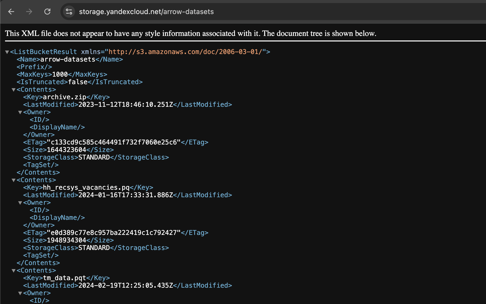
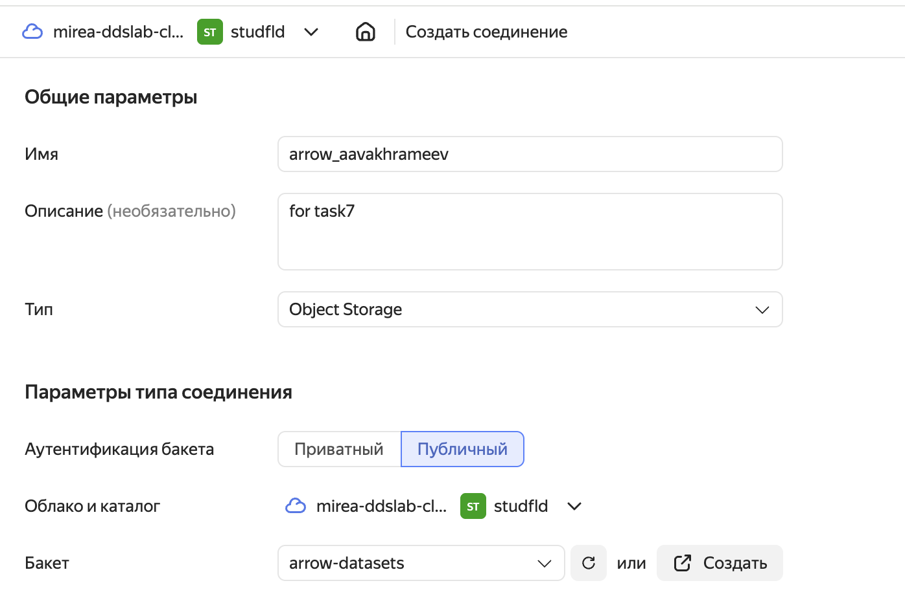
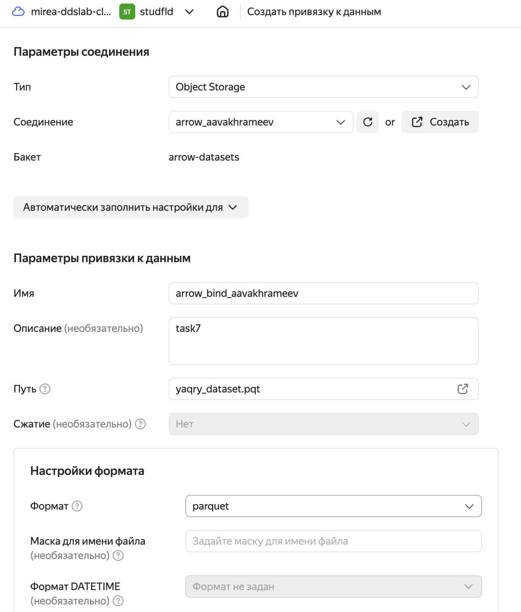
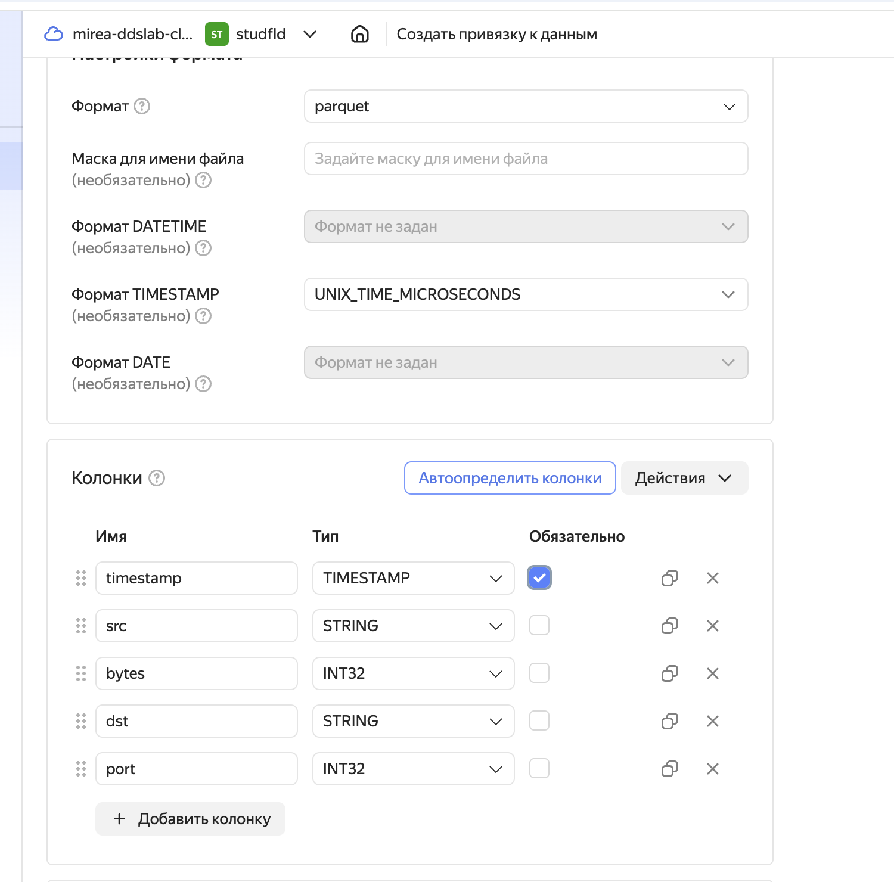
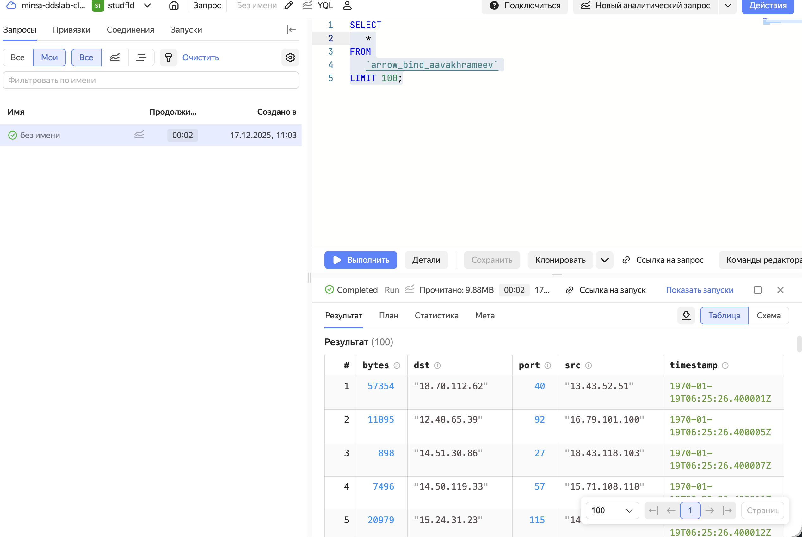
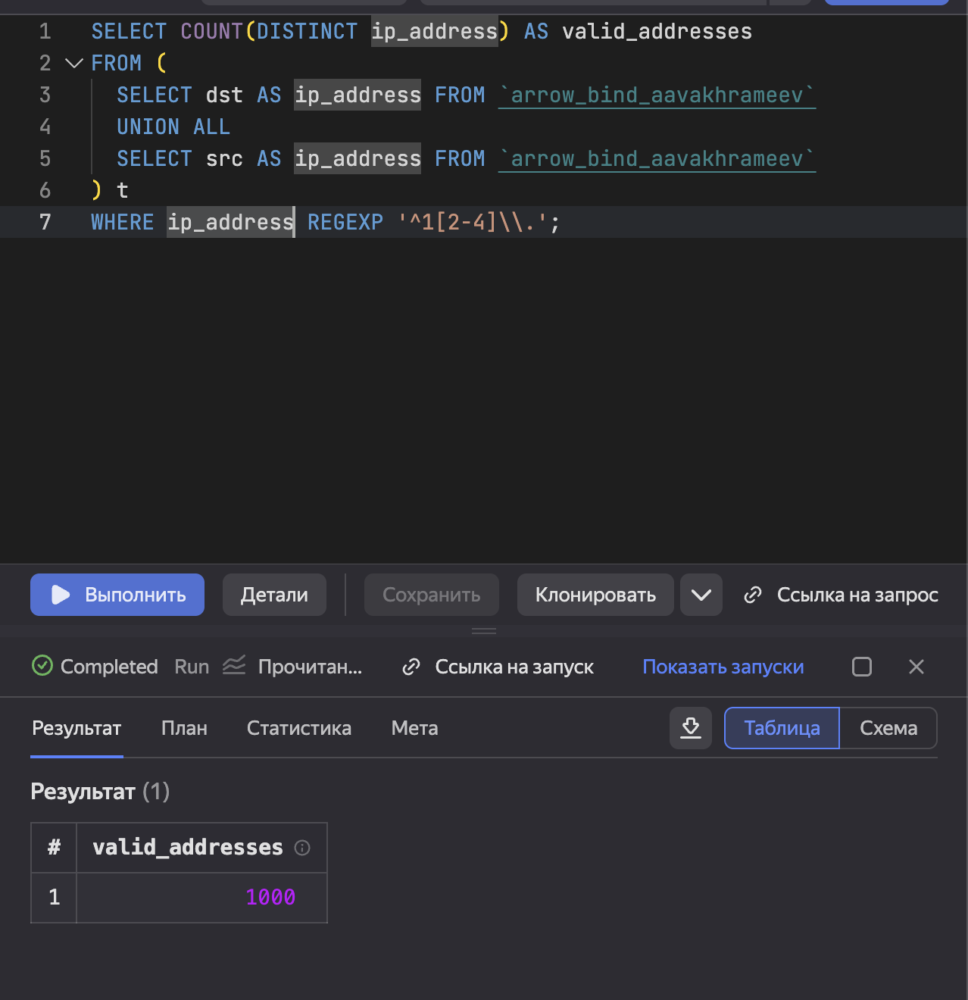
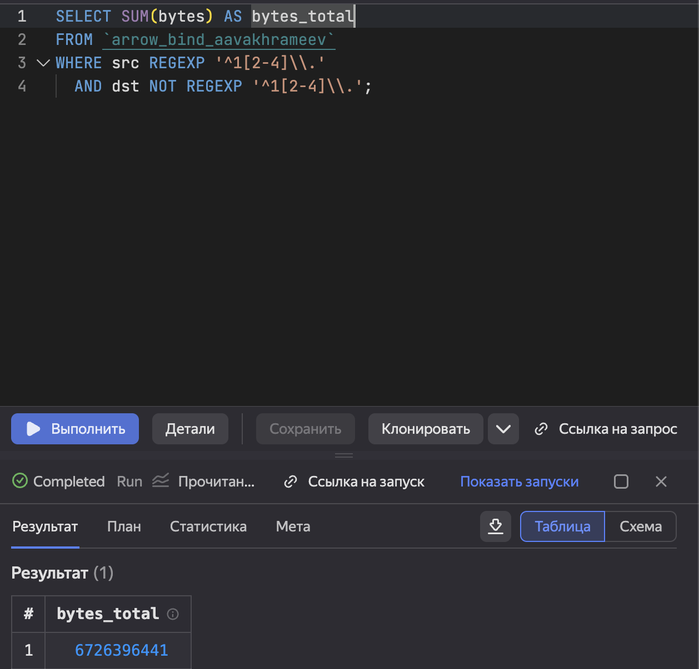

# pr 07 vakhrameev
vakhrameevaleksandr@yandex.ru

## Цель работы

1.  Изучить возможности технологии Yandex Query для анализа
    структурированных наборов данных
2.  Получить навыки построения аналитического пайплайна для анализа
    данных с помощью сервисов Yandex Cloud
3.  Закрепить практические навыки использования SQL для анализа данных
    сетевой активности в сегментированной корпоративной сети

## Исходные данные

1.  Оепрационная система Darwin Mac.lan 25.0.0 Darwin Kernel Version
    25.0.0
2.  IDE Positron
3.  R version 4.5.2
4.  Yandex Query

## Общая ситуация

Вам стали доступны данные сетевой активности в корпоративной сети
компании XYZ. Данные хранятся в Yandex Object Storage. Проведите
разведочный анализ данных и ответьте на вопросы

## Задание

Используя сервис Yandex Query настроить доступ к данным, хранящимся в
сервисе хранения данных Yandex Object Storage. При помощи
соответствующих SQL запросов ответить на вопросы

## Ход работы

### Подготовка данных

1.  Проверить доступность данных в Yandex Object Storage.
2.  Подключить бакет как источник данных для Yandex Query.
3.  Просмотрите общую структуру данных с помощью функции `glimpse()`

### Анализ данных

1.  Известно, что IP адреса внутренней сети начинаются с октетов,
    принадлежащих интервалу \[12-14\]. Определите количество хостов
    внутренней сети, представленных в датасете.
2.  Определите суммарный объем исходящего трафика.
3.  Определите суммарный объем входящего трафика.

### Подготовка

### 1. Проверить доступность данных в Yandex Object Storage

Выполним запрос в api к нужному бакету.

### 2. Подключить бакет как источник данных для Yandex Query

Создадим соединение для public s3:

Создадим привязку данных:

Укажем типы данных столбцов

Выведем данные через YQL

### Анализ

#### 1. Известно, что IP адреса внутренней сети начинаются с октетов, принадлежащих интервалу \[12-14\]. Определите количество хостов внутренней сети, представленных в датасете.

Выполним следующий запрос для анализа

    SELECT COUNT(DISTINCT ip_address) AS valid_addresses
    FROM (
      SELECT dst AS ip_address FROM `arrow_bind_aavakhrameev`
      UNION ALL
      SELECT src AS ip_address FROM `arrow_bind_aavakhrameev`
    ) t
    WHERE ip_address REGEXP '^1[2-4]\\.';

#### 2. Определите суммарный объем исходящего трафика

Выполним следующий запрос для анализа

    SELECT SUM(bytes) AS bytes_total
    FROM `arrow_bind_aavakhrameev`
    WHERE src REGEXP '^1[2-4]\\.'
      AND dst NOT REGEXP '^1[2-4]\\.';

#### 3. Определите суммарный объем входящего трафика

Выполним следующий запрос для анализа.

    SELECT SUM(bytes)
        FROM `frakenbok-data-binding` 
        WHERE 
            src NOT REGEXP '^1[2-4]\.' AND
            dst REGEXP '^1[2-4]\.'

## Вывод

В данной работе я изучил принципы работы с Yandex Cloud и Yandex Query.
